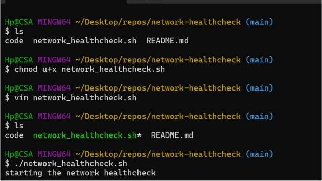
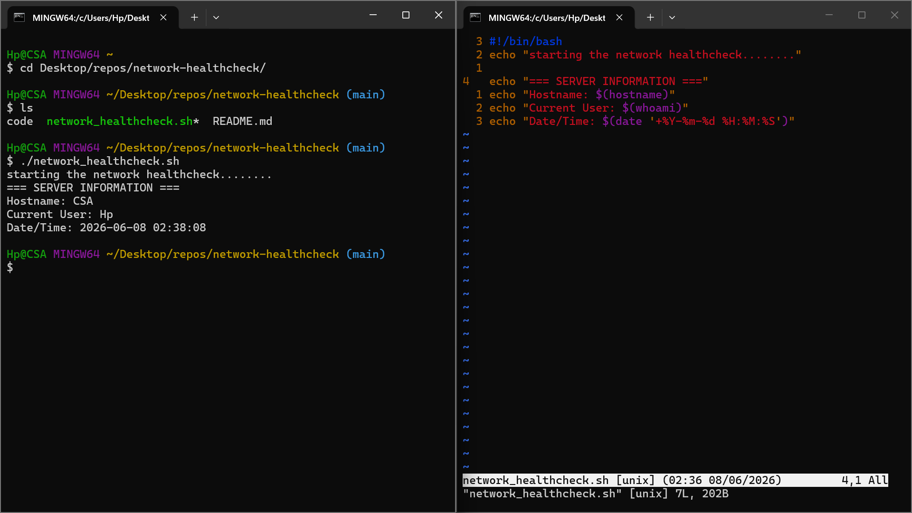
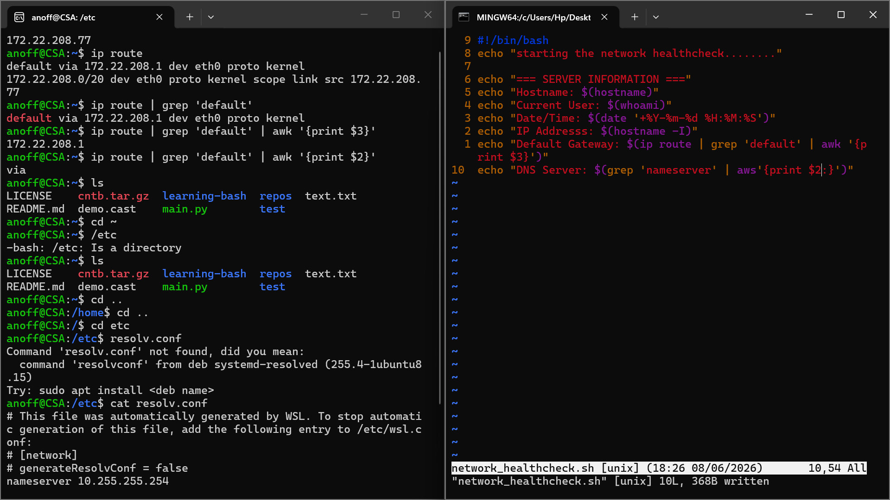
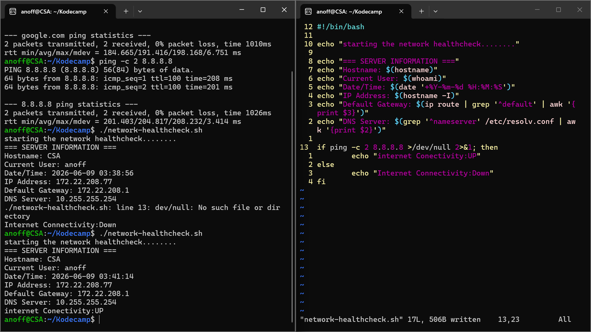
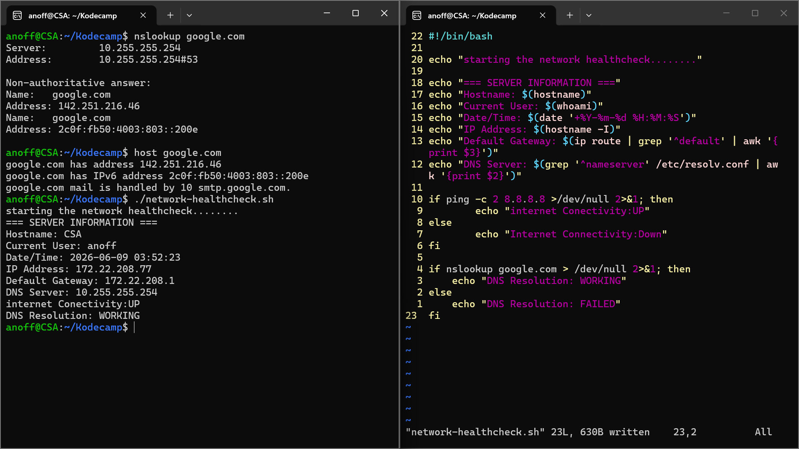
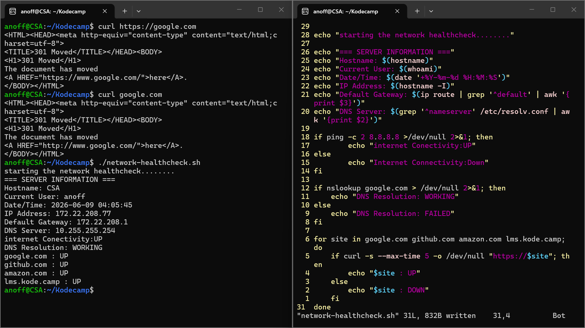
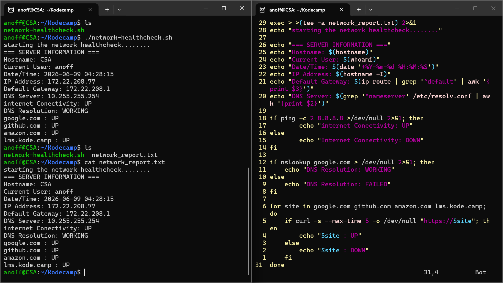

# 🌐 Network Health Check

A Bash script that checks the health of a server's network connectivity and generates a report. Built as part of a junior DevOps learning journey on WSL2 (Ubuntu) + Windows.

---

## 📋 What It Does

The script runs six checks automatically and saves everything to a report file:

1. **Server Information** — hostname, current user, date and time
2. **Network Information** — IP address, default gateway, DNS server
3. **Internet Connectivity** — pings `8.8.8.8` and reports UP or DOWN
4. **DNS Resolution** — resolves `google.com` and reports WORKING or FAILED
5. **Website Availability** — checks a list of websites and reports UP or DOWN for each
6. **Report Generation** — saves all output to `network_report.txt` automatically

---

## 🛠️ Prerequisites

Make sure the following tools are available on your system:

- `ping` — internet connectivity check
- `curl` — website availability check
- `nslookup` — DNS resolution check
- `ip` — gateway extraction
- `awk` and `grep` — output parsing
- `tee` — report file generation

All of these come pre-installed on most Linux distributions including WSL2 (Ubuntu).

---

## ⚙️ Setup

**Clone the repository:**

```bash
git clone https://github.com/Anofff/network-health-check.git
cd network-health-check
```

**Make the script executable:**

```bash
chmod +x network_healthcheck.sh
```

---

## 🚀 How to Run

```bash
./network_healthcheck.sh
```

The script prints all results to the terminal and saves them to `network_report.txt` in the same directory.

---

## 📊 Sample Output

```
starting the network healthcheck........
=== SERVER INFORMATION ===
Hostname: CSA
Current User: anoff
Date/Time: 2026-06-09 04:28:15
IP Address: 172.22.208.77
Default Gateway: 172.22.208.1
DNS Server: 10.255.255.254
Internet Connectivity: UP
DNS Resolution: WORKING
google.com : UP
github.com : UP
amazon.com : UP
lms.kode.camp : UP
```

---

## 📁 Project Structure

```
network-health-check/
├── network_healthcheck.sh    # Main script
├── network_report.txt        # Auto-generated report (created on first run)
└── README.md                 # This file
```

---

## 📸 Learning Journey Screenshots

### Phase 1 — Project setup: chmod +x and first run in Git Bash
Getting the repo set up on Windows, making the script executable, and running it for the first time. At this stage only the shebang and first echo existed.



---

### Phase 2 — Server information section working
First milestone: hostname, current user, and date/time all printing correctly using command substitution `$(...)`. Script running from Git Bash against the Windows filesystem.



---

### Phase 3 — Switching to WSL2 and extracting network info
Moved from Git Bash to WSL2 (Ubuntu) after hitting `ip: command not found`. Debugged `ip route | grep | awk` to extract the gateway, and `grep nameserver /etc/resolv.conf` to extract the DNS server. Also caught a classic typo: `resolve.conf` instead of `resolv.conf`.



---

### Phase 4 — Internet connectivity check and the /dev/null bug
Added the `ping -c 2 8.8.8.8` check inside an `if` statement. Hit the `dev/null: No such file or directory` error — missing the leading slash. Fixed to `>/dev/null 2>&1` and connectivity check started returning UP correctly.



---

### Phase 5 — DNS resolution check
Tested both `nslookup` and `host` commands manually to understand what they return. Added the DNS check block using `nslookup google.com > /dev/null 2>&1` inside an `if` statement. DNS Resolution: WORKING confirmed.



---

### Phase 6 — Website availability loop
Tested `curl` manually to understand its output (got the 301 redirect from google.com — expected behaviour). Added the `for` loop iterating over `google.com github.com amazon.com lms.kode.camp` using `curl -s --max-time 5 -o /dev/null`. All four sites reporting UP.



---

### Phase 7 — Report file generation and final script
Added `exec > >(tee -a network_report.txt) 2>&1` at the top of the script. Ran the script, confirmed `network_report.txt` was created, and verified the contents with `cat network_report.txt` — full output saved correctly. Final complete script visible in Vim on the right.



---

## 🧠 Key Concepts Learned

- **Shebang (`#!/bin/bash`)** — tells the OS to use Bash to interpret the script
- **Command substitution (`$(...)`)** — captures command output inline inside echo statements
- **Exit codes** — how Bash knows if a command succeeded or failed, used inside `if` statements
- **`/dev/null`** — a black hole that discards output; `>/dev/null 2>&1` suppresses both stdout and stderr
- **`awk '{print $N}'`** — extracts a specific word from a line by its position number
- **`grep`** — filters output to lines matching a keyword; typos return empty (caught `namesever` vs `nameserver`)
- **`for` loops** — iterates over a list to run the same check on multiple targets
- **`exec > >(tee -a file)`** — redirects all script output simultaneously to the terminal and a file
- **WSL2** — a real Linux environment inside Windows; required for `ip`, `hostname -I`, and other Linux networking tools that Git Bash doesn't support

---

## 🐛 Bugs Encountered and Fixed

| Bug | Cause | Fix |
|---|---|---|
| `ip: command not found` | Running in Git Bash, not Linux | Switched to WSL2 |


---

## 🌍 Environment

Developed and tested on:
- **OS:** Ubuntu 24 via WSL2 on Windows 11
- **Shell:** Bash
- **Editor:** Vim

---

## 👤 Author

**Anoff** — Junior DevOps Engineer in training  
GitHub: [@Anofff](https://github.com/Anofff)


